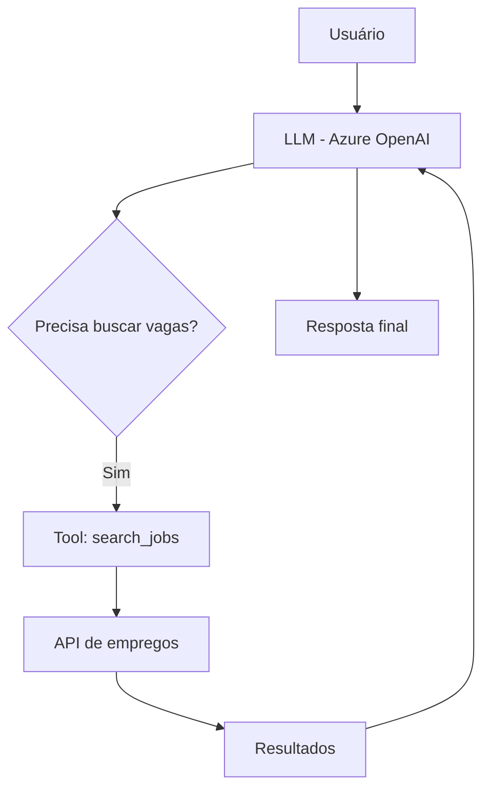

# JobAgent — AI Job Search Assistant

Agente inteligente de busca de vagas utilizando **Azure OpenAI + Function Calling + APIs externas**, capaz de interpretar solicitações em linguagem natural e retornar oportunidades relevantes em tempo real.

---

## Visão Geral

O **JobAgent** é um assistente de IA que automatiza a busca por vagas de emprego.
Ele entende pedidos do usuário (ex: *"quero vagas de Python remoto"*) e:

1. Interpreta a intenção com LLM (Azure OpenAI)
2. Normaliza os termos de busca
3. Consulta uma API de vagas (RapidAPI)
4. Retorna resultados estruturados e relevantes

---

## Tecnologias Utilizadas

* **Python 3.10+**
* **Azure OpenAI (GPT-4 / GPT-4o-mini)**
* **Function Calling (Agents)**
* **RapidAPI (Job Search API)**
* **Pydantic (tipagem e validação)**
* **dotenv (gestão de variáveis de ambiente)**

---

## Arquitetura

```
project/
│
├── agent.py              # Configuração do agente e instruções
├── main.py               # Interface de chat (CLI)
├── tools/
│   └── search_jobs.py    # Tool de busca de vagas (API + fallback)
│
├── mock_data/
│   └── jobs.json         # Dados mockados (fallback)
│
└── .env                  # Variáveis sensíveis
```

---

## Como Funciona



---

## Configuração

### 1. Clone o repositório

```bash
git clone https://github.com/seu-usuario/job-agent.git
cd job-agent
```

---

### 2. Crie o arquivo `.env`

```env
AZURE_OPENAI_ENDPOINT=your_endpoint
AZURE_OPENAI_KEY=your_key
AZURE_OPENAI_DEPLOYMENT=your_deployment_name

RAPIDAPI_KEY=your_rapidapi_key
```

---

### 3. Instale as dependências

```bash
pip install -r requirements.txt
```

---

### 4. Execute o projeto

```bash
python main.py
```

---

## Exemplo de Uso

```
Você: vagas de python remoto

JobAgent:
 Buscando vagas...

- Software Engineer — Remote
  Empresa: XYZ Tech
  Local: Remote
  Link: https://...

- Backend Developer — Brazil
  Empresa: ABC Corp
  Local: Brasil
```

---

## Funcionalidades

- Interpretação de linguagem natural
- Function calling com ferramentas externas
- Normalização inteligente de termos
- Fallback com dados mockados
- Tratamento de erros e rate limit
- Arquitetura modular e escalável

---

## Limitações

* Dependência de APIs externas (podem retornar poucos dados)
* Rate limit da Azure OpenAI (plano gratuito)
* Qualidade dos resultados depende dos termos normalizados

---

## Próximos Passos

* [ ] Integração com LinkedIn / Indeed (scraping)
* [ ] Auto-apply em vagas
* [ ] Ranking de vagas por match com currículo
* [ ] Interface web (Streamlit ou React)
* [ ] Banco de dados para histórico de buscas

---

## Autor

**Antonio Augusto**
[antonioaugustoalt@gmail.com](mailto:antonioaugustoalt@gmail.com)
Florianópolis, SC

---

## Destaque

Este projeto demonstra habilidades práticas em:

* Engenharia de prompts
* Integração com APIs reais
* Arquitetura de agentes de IA
* Automação de tarefas reais (job hunting)

---
